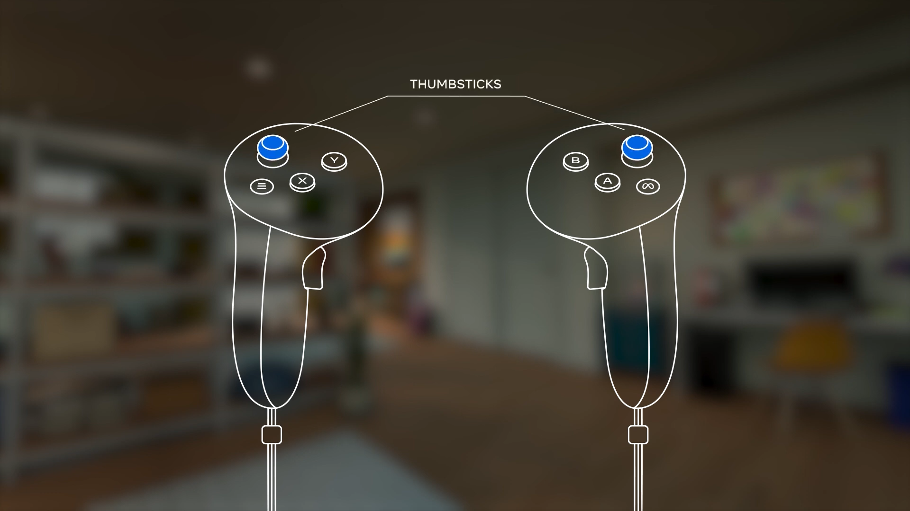
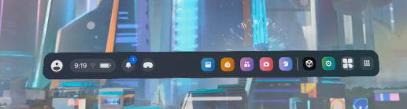
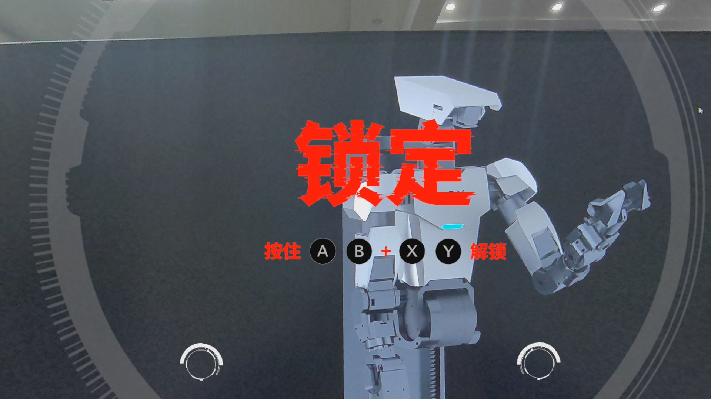
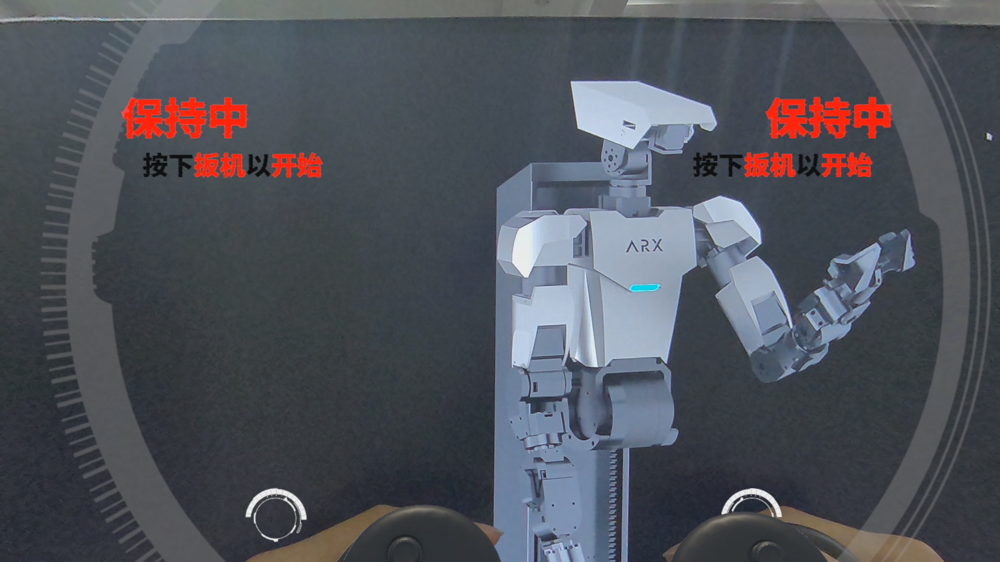
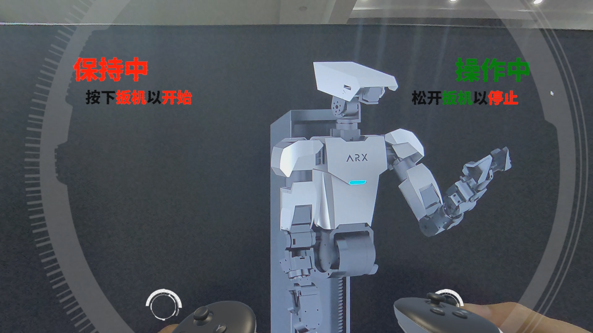
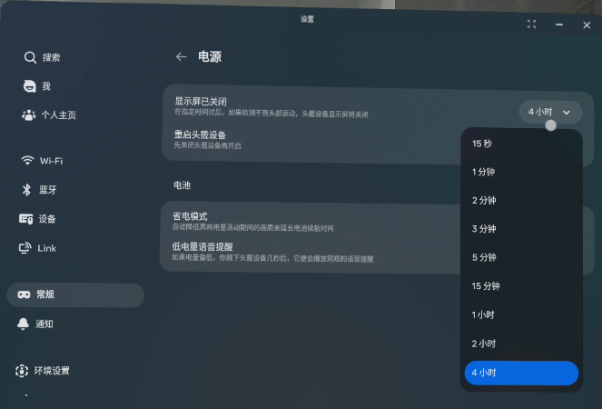

## 打开包装

包装盒打开后如下

分别是左右手柄头显 TypeC线和充电适配器
## 认识头显按钮

LED指示灯

电源按钮长按5秒开机

音量按钮（上）和透视切换按钮（下）
## 认识手柄

左手柄 和 右手柄

meta按键

左摇杆和右摇杆

食指扳机

侧方扳机
## 开机
电源按钮长按5秒开机

开机后头显画面如图所示，可以按下透视切换按钮切换透视

拿起左右手手柄，请确保左右手柄电池均有电，可以正确在视野中观察到

左侧从左至右 菜单栏 账户 菜单栏 消息 透视切换
右侧从右至左 应用列表 MTP（无作用）设置 X5_MR_Control

用食指扳机选择并进入X5_MR_Control(左右手均可)

如果你找不到菜单或者菜单栏不存在，请按右手meta键

## 如何通过X5_MR_Control操作机械臂（软件端）
进入X5_MR_Control等待加载完毕

进入程序 要求解锁 语音提示 锁定 锁定 锁定  
同时按下左手柄 X Y 按键 右手柄 A B 按键  语音锁定消失字幕不消失  
同时垂直按下左摇杆和右摇杆 锁定字幕消失  

解锁完毕，如图是解锁完毕的图像  
保持中状态机械臂不会移动会一直保持在此状态

按下右手柄的食指扳机，显示操作中  此状态机械臂会跟随手柄1 比 1 运动
左手柄同理

按下左手柄的X按键，显示复位中  此状态机械臂会逐渐复位到0点  
### 具体的操作如下图表格所示
<table style="width:100%; border-collapse: collapse; text-align: left;">
    <tr>
        <td colspan="3" style="border: 1px solid black;">开机启动操作</td>
    </tr>
    <tr>
        <td colspan="3" style="border: 1px solid black;">1.同时按下 AB(右手)XY（左手）双手持握解锁 （锁定语音消失，表示手持部分已解锁）</td>
    </tr>
    <tr>
        <td colspan="3" style="border: 1px solid black;">2.同时长按 左右摇杆键（直至语音提示控制器上线）机械臂完整解锁</td>
    </tr>
    <tr>
        <th style="border: 1px solid black;">操作方式</th>
        <th style="border: 1px solid black;">按键映射</th>
        <th style="border: 1px solid black;">行为</th>
    </tr>
    <tr>
        <td style="border: 1px solid black;">按下右手</td>
        <td style="border: 1px solid black;">食指扳机</td>
        <td style="border: 1px solid black;">右侧机械臂1比1空间移动</td>
    </tr>
    <tr>
        <td style="border: 1px solid black;">按下左手</td>
        <td style="border: 1px solid black;">食指扳机</td>
        <td style="border: 1px solid black;">左侧机械臂1比1空间移动</td>
    </tr>
    <tr>
        <td style="border: 1px solid black;">松开右手</td>
        <td style="border: 1px solid black;">食指扳机</td>
        <td style="border: 1px solid black;">右侧机械臂保持空间位姿</td>
    </tr>
    <tr>
        <td style="border: 1px solid black;">松开左手</td>
        <td style="border: 1px solid black;">食指扳机</td>
        <td style="border: 1px solid black;">左侧机械臂保持空间位姿</td>
    </tr>
    <tr>
        <td style="border: 1px solid black;">按下右手</td>
        <td style="border: 1px solid black;">侧方扳机</td>
        <td style="border: 1px solid black;">右侧机械臂夹爪线性闭合</td>
    </tr>
    <tr>
        <td style="border: 1px solid black;">按下左手</td>
        <td style="border: 1px solid black;">侧方扳机</td>
        <td style="border: 1px solid black;">左侧机械臂夹爪线性闭合</td>
    </tr>
    <tr>
        <td style="border: 1px solid black;">长按右手</td>
        <td style="border: 1px solid black;">A按键</td>
        <td style="border: 1px solid black;">右侧机械臂归0</td>
    </tr>
    <tr>
        <td style="border: 1px solid black;">长按左手</td>
        <td style="border: 1px solid black;">X按键</td>
        <td style="border: 1px solid black;">左侧机械臂归0</td>
    </tr>
    <tr>
        <td colspan="3" style="border: 1px solid black;">注意:每次VR头显移动位置或变更方向后,长按右侧手柄Meta键两秒重置方向</td>
    </tr>
</table>

<table style="width: 100%; text-align: left; border: 1px solid black; border-collapse: collapse;">
  <tr>
    <th colspan="3" style="font-weight: bold; text-align: left; border: 1px solid black;">lift空间抓取额外按键</th>
  </tr>
  <tr>
    <td colspan="3" style="font-weight: bold; text-align: left; border: 1px solid black;">首先开启底盘保护：右摇杆 B解除保护，左摇杆 Y开启保护</td>
  </tr>
  <tr>
    <th style="border: 1px solid black; text-align: center;">操作方式</th>
    <th style="border: 1px solid black; text-align: center;">按键映射</th>
    <th style="border: 1px solid black; text-align: center;">行为</th>
  </tr>
  <tr>
    <td style="border: 1px solid black; text-align: center;">左摇杆</td>
    <td style="border: 1px solid black; text-align: center;">前进</td>
    <td style="border: 1px solid black; text-align: center;">工作平台上移</td>
  </tr>
  <tr>
    <td style="border: 1px solid black; text-align: center;">左摇杆</td>
    <td style="border: 1px solid black; text-align: center;">横移</td>
    <td style="border: 1px solid black; text-align: center;">底盘转向</td>
  </tr>
  <tr>
    <td style="border: 1px solid black; text-align: center;">右摇杆</td>
    <td style="border: 1px solid black; text-align: center;">前进</td>
    <td style="border: 1px solid black; text-align: center;">底盘向前走</td>
  </tr>
  <tr>
    <td style="border: 1px solid black; text-align: center;">右摇杆</td>
    <td style="border: 1px solid black; text-align: center;">横移</td>
    <td style="border: 1px solid black; text-align: center;">NULL</td>
  </tr>
</table>

## 延长息屏时间
如果长时间无操作 quest将试图进入休眠 
以下是将休眠时间调整为四小时的教程

打开菜单 选择 设置

选择  常规 - 电源

显示屏已关闭 - 4小时

